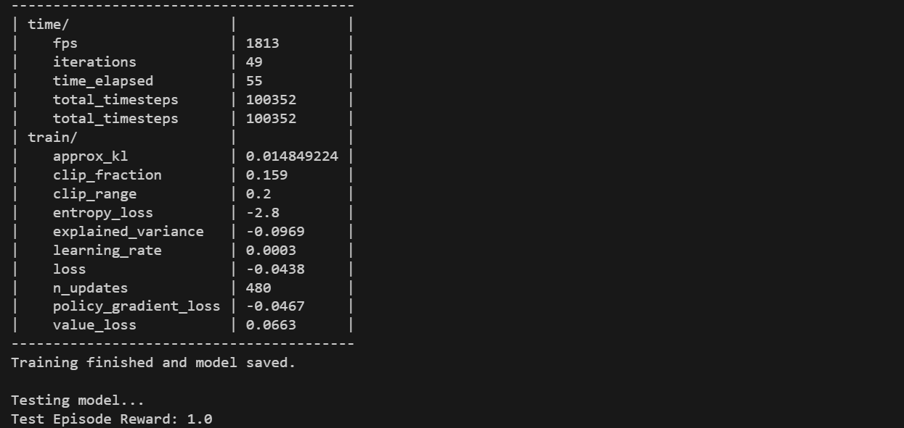

# icu-sepsis_reproduce

这是我找到的一个rl+医学的环境，之前和老师交流的时候发现这种环境很少几乎没有，现在好不容易找到一个，感觉可以上手来玩玩

## 环境安装
```bash
pip install icu-sepsis pip install stable-baselines3[extra]
```

## 测试
```python
python test.py
```

然后执行
```python
python ppo.py
```

